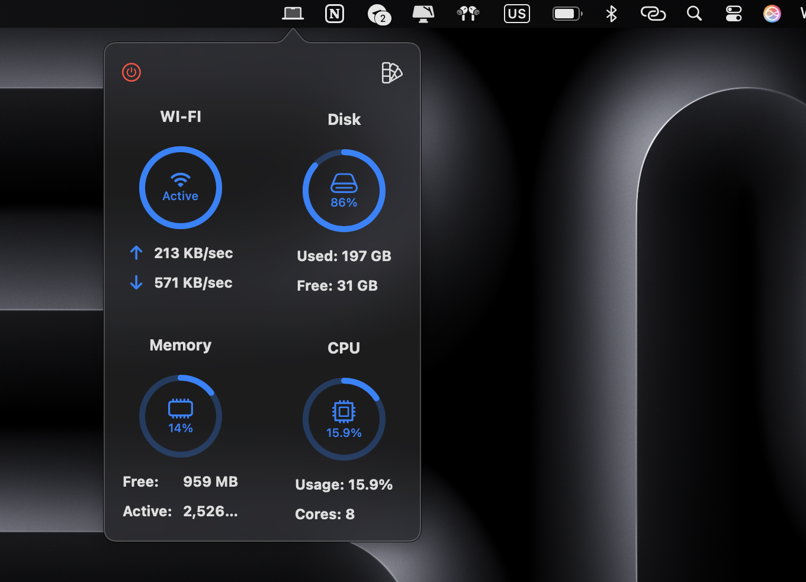
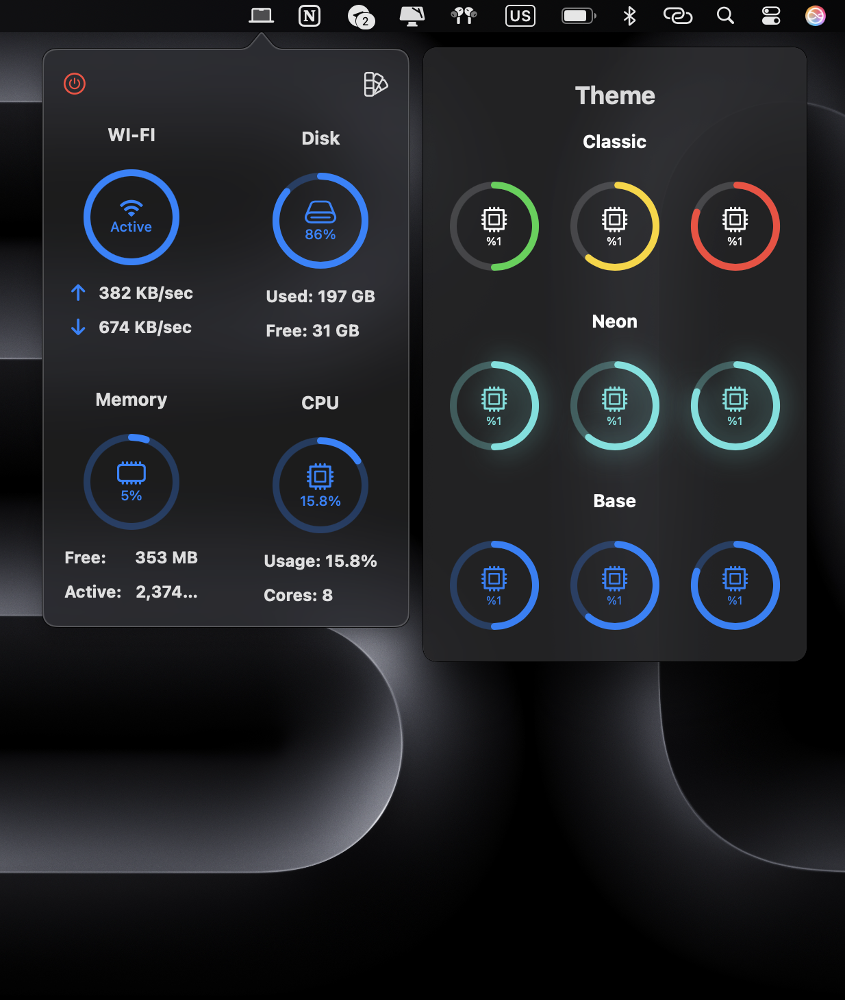

# 📊 Stats for Mac

A lightweight macOS menu bar app that displays real-time **WiFi speed, CPU usage, disk usage, and memory usage**. It also offers **customizable themes** for a personalized experience.

  

## ✨ Features

- 📶 **WiFi Speed Monitoring** – View current upload and download speeds.
- 🔥 **CPU Usage** – Keep an eye on your processor's performance.
- 💾 **Disk Usage** – Check available and used storage space.
- 🧠 **Memory Usage** – Monitor RAM usage in real-time.
- 🎨 **Custom Themes** – Switch between different themes for a personalized look.

## ⚙️ How to Use

- The app sits in the **macOS menu bar**.
- Click on the icon to **view system stats**.
- Customize the **theme** in the settings.

## 📜 License

This project is licensed under the **MIT License**.

